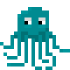

## Squidlegs: ES6 Game Framework

Quick and dirty game framework that works with Babel and Gulp so you can write ES6 game code today, instead of &infin; days from now.

It consists of –

- 1 squid
- `library/` A basic set of ES6 Javascript classes, designed to be pretty modular so you can `new` whatever you actually need
	- `Loop` - use `requestAnimationFrame` to setup your main game loop
	- `Canvas`, `DomCanvas`, and `VirtualCanvas` - wrapper to draw to an onscreen or offscreen canvas (holds `context` and has helpers like `rotate`)
	- `Mouse` - handles the conversion between click events and simple coordinates on a canvas
	- `Keyboard` and `KeyboardMovement` - handles `wasd` / &uarr;&rarr;&darr;&larr; events, and translation to location deltas and facing degrees
	- `Sprite` - loads a sprite sheet image, stores it in an offscreen canvas (to allow for rotation), and draws to a canvas
	- `Font` - loads and displays simple pixel fonts in the format of (one section per line)
		- `0..9`
		- `A..Z`
		- `Extras`
- `gulpfile.js` to translate the framework and your code into ES6 via [Babel](https://babeljs.io)
- `game/` - where your actual game code might go, currently home to a sample `main.js`
- `index.html` - a test page

It's open source, unstable, and has no tests - it may eat your dog, my dog, or any number of other figurative dogs.

### @todo

- Add a cohesive `export` / `import` system - currently extending classes depends on ordering the `gulpfile` – not cool
- Add moar things!